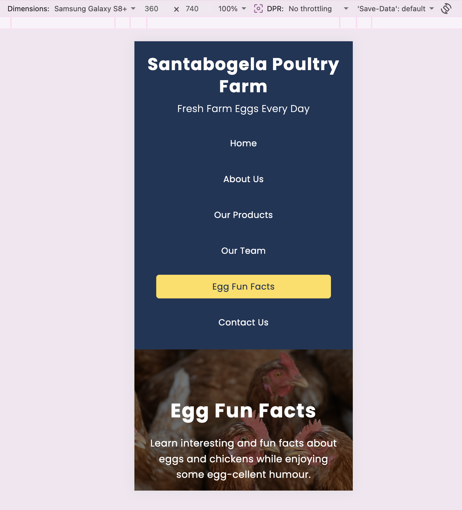
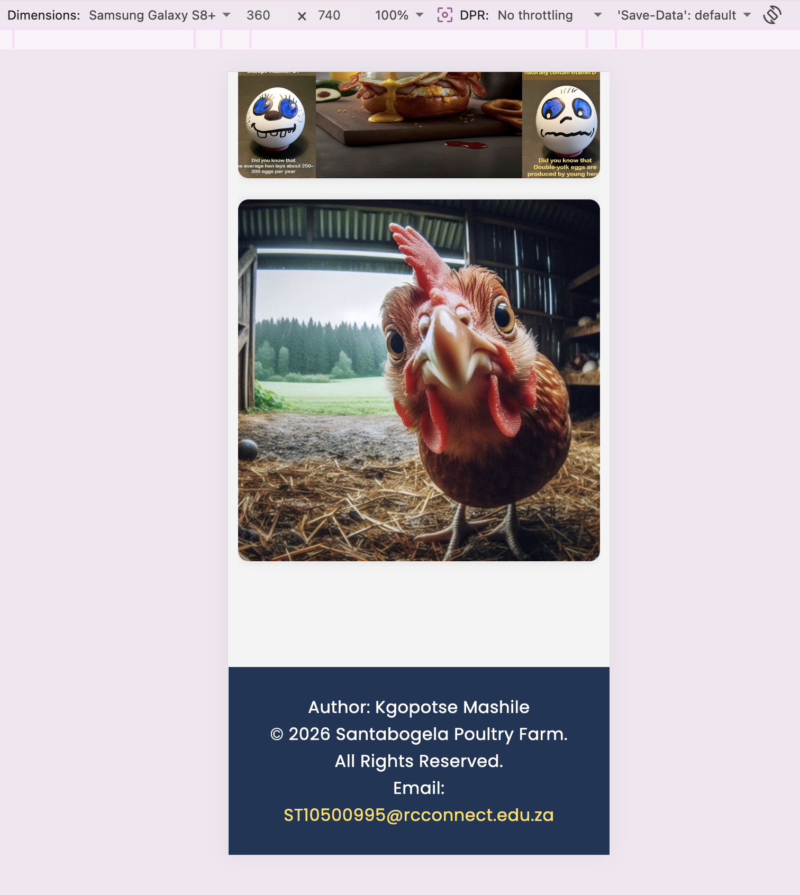
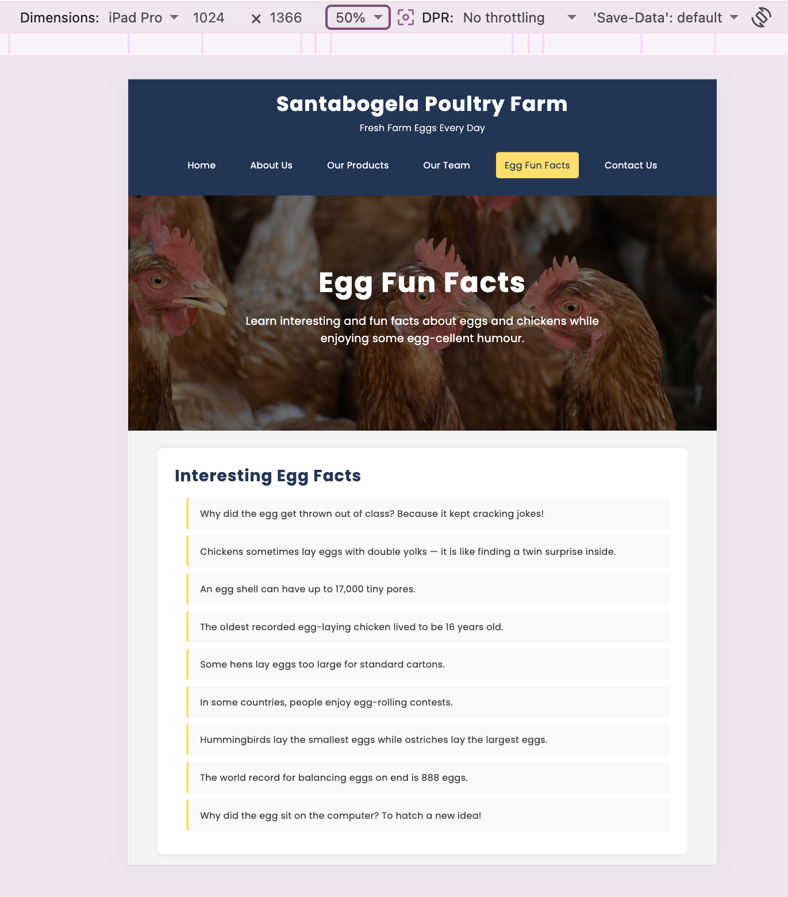
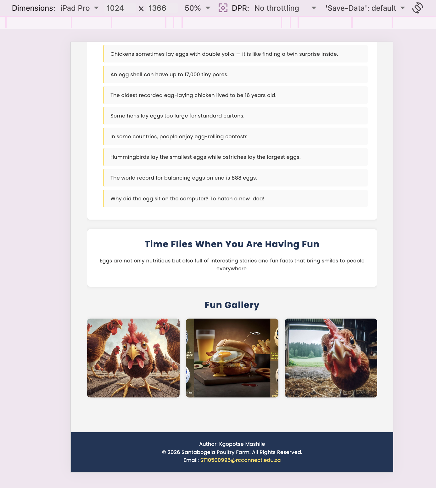
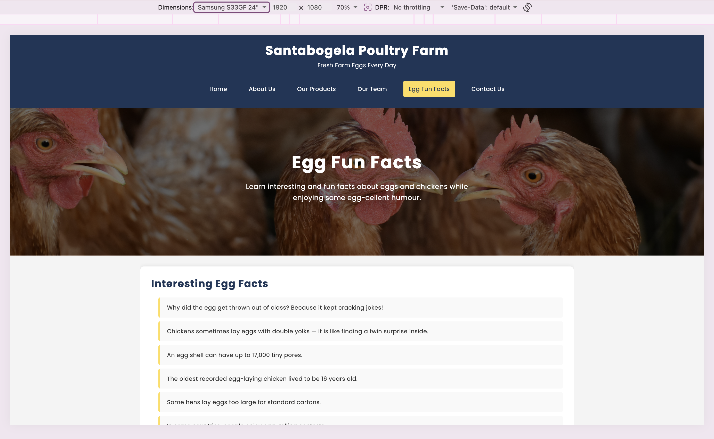
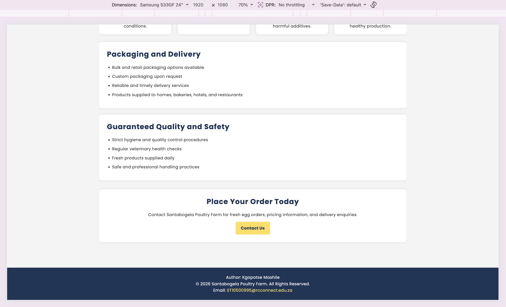

# Santabogela Poultry Farm Website
By ST10500995

## Project Overview

This project involves the development of a comprehensive website for Santabogela Poultry Farm, a family-owned poultry farm located in Winterveld, Gauteng, South Africa. The website serves as the digital presence for this local business that has been serving customers with fresh, farm-produced eggs since 2021, specialising in high-quality table eggs, brown eggs, organic eggs, and free-range eggs.

The Santabogela Poultry Farm website development project spans 12 weeks across three distinct phases, each building upon the previous foundation to create a comprehensive online presence for the farm.

The development of this website addresses the need for a professional online platform for Santabogela Poultry Farm. Through research into the farm's operations, family history, and customer needs, comprehensive insights were gathered regarding business values, product offerings, and website requirements. This information serves as the foundation for creating a digital platform that accurately represents the farm's commitment to quality, community, and ethical poultry farming.

The website showcases Santabogela Poultry Farm's dedication to delivering fresh, healthy eggs from well-cared-for hens, while providing exceptional service to families, restaurants, bakeries, and local businesses across Gauteng and Mpumalanga. The digital platform reflects the farm's mission to honour the legacy of its late founder, Santabogela Carpos Mashile, by continuing his values of hard work, family, and community care.

## Website Goals and Objectives

### Primary Goals

The website has been designed to achieve several key business objectives:

**Product Information Accessibility:** Customers can view the complete range of egg products online, providing convenient access to table eggs, brown eggs, organic eggs, and free-range eggs without needing to visit the farm or make phone calls for basic product information.

**Brand Awareness and Trust:** The platform presents the farm's story, team values, and commitment to quality, helping build trust with local customers and businesses in Pretoria, Soshanguve, Winterveld, and Middelburg.

**Easy Contact and Ordering Enquiries:** The contact page provides multiple communication channels including telephone numbers, email, and location details, enabling customers to place orders and make delivery enquiries with minimal effort.

**Community Engagement:** The Egg Fun Facts page adds an educational and engaging element that connects visitors with the farm's poultry expertise and builds customer interest.

**Professional Digital Presence:** The website establishes Santabogela Poultry Farm as a credible, modern business that reflects the quality of its farm-fresh products.

### Key Performance Indicators

The success of the website will be measured through several metrics:

- Monthly website traffic to gauge overall reach and engagement
- Number of contact page interactions (phone calls and email enquiries)
- Time spent on product and about pages to assess content relevance
- Bounce rate analysis to evaluate user engagement
- Mobile versus desktop traffic to assess responsive design effectiveness

### Target Audience

The website specifically caters to:

- Local families and individuals residing in Winterveld, Soshanguve, Mabopane, and Pretoria
- Restaurant owners, bakeries, and hotels seeking reliable egg suppliers
- Health-conscious consumers looking for organic and free-range egg options
- Community members within Gauteng and surrounding areas who value locally sourced farm products
- Small businesses in Middelburg and nearby towns requiring bulk egg orders

## Key Features and Functionality

### Essential Pages Structure

The website comprises six main sections, each serving specific user needs:

**Homepage (`index.html`):** Acts as the digital storefront featuring a hero banner with farm imagery, a brief introduction to Santabogela Poultry Farm, prominent call-to-action buttons for viewing products and contacting the farm, a farm gallery, customer reviews, and footer contact information.

**About Us (`about.html`):** Tells the farm's story, including its establishment in 2021, the inspiration behind the name Santabogela, the legacy of Santabogela Carpos Mashile, the farm's location in Winterveld within the City of Tshwane Metropolitan Municipality, mission statement, and core values.

**Our Products (`products.html`):** Provides comprehensive product information organised into four main categories — table eggs, brown eggs, organic eggs, and free-range eggs — with product descriptions, packaging and delivery details, and quality assurance information.

**Our Team (`team.html`):** Presents the farm as a family-oriented team built on values of care, respect, teamwork, and dedication, including team photographs, animal care and sustainability practices, and the farm's vision for the future.

**Egg Fun Facts (`eggfunfacts.html`):** Offers an engaging educational section with interesting facts about eggs and chickens, a fun gallery, and light-hearted content to connect with visitors.

**Contact Us (`contact.html`):** Offers multiple communication channels including sales telephone numbers for Pretoria and Middelburg, email address, farm locations across four areas, clickable call and email buttons, and a contact image gallery.

### Core Functionality

**Mobile Responsiveness:** The website adapts seamlessly across all device types, ensuring optimal user experience on smartphones, tablets, and desktop computers through CSS media queries and relative units.

**Consistent Navigation:** A unified navigation menu appears on every page with an active state indicator showing the current page, ensuring intuitive movement between sections.

**Visual Product Presentation:** CSS Grid layouts display product cards and image galleries in responsive multi-column formats that collapse to single columns on mobile devices.

**Direct Communication Links:** Clickable telephone (`tel:`) and email (`mailto:`) links on the contact page enable one-tap communication from mobile devices.

**User Experience Optimisation:** The design prioritises simplicity and readability, allowing visitors to access product information and contact details with minimal clicks whilst maintaining high contrast for readability and consistent visual branding throughout all pages.

### Technical Implementation

Through the use of GitHub and Visual Studio Code, the website utilises modern web technologies, including HTML5 for semantic structure and CSS3 for visual styling and responsive design. The responsive framework ensures compatibility across all devices and screen sizes.

The project is hosted on GitHub at [https://github.com/ST10500995/santabogelapoultyfarm](https://github.com/ST10500995/santabogelapoultyfarm), ensuring version control, regular commits, and structured project documentation. The technical architecture supports future scalability for Part 3 JavaScript enhancements.

### Content Strategy

All website content has been developed through primary research into Santabogela Poultry Farm's history, operations, and values. Visual elements include original farm photography showcasing chickens, eggs, team members, and contact imagery. Professional typography from Google Fonts (Poppins) and a carefully selected colour scheme reflect the farm's trustworthy, community-focused identity.

The content strategy emphasises local relevance within the South African context whilst maintaining professional presentation standards that build customer trust and encourage contact and ordering enquiries.

## Development Timeline

### Phase 1: Foundation (Weeks 1 – 5)

**Duration:** Weeks 1 – 5 of the semester

The initial phase focuses on establishing the groundwork for the entire project. During the first week, thorough research into the farm's needs is conducted and the project proposal is submitted whilst setting up the GitHub repository. Week two involves detailed content planning, including finalising the sitemap design and creating wireframes for all pages. The third and fourth weeks concentrate on HTML development, building the structural foundation for all six pages using semantic HTML tags and implementing a functional navigation system. The final week of this phase involves comprehensive testing, HTML validation, and preparation for the Part 1 submission.

**Part 1 Submission:** End of Week 5

### Phase 2: Visual Design and Responsive Development (Weeks 6 – 9)

**Duration:** Weeks 6 – 9 of the semester

This phase focused on transforming the HTML foundation into a visually appealing and responsive website using CSS styling techniques.

#### Week 6: CSS Foundation and Base Styling

- Created external CSS stylesheet (`css/style.css`) and linked to all HTML pages
- Implemented CSS reset for cross-browser consistency
- Established base typography using Google Fonts (Poppins for headings and body text)
- Applied colour scheme based on farm branding aesthetic:
  - Primary: Deep Blue (#1d3557)
  - Accent: Golden Yellow (#ffdd57)
  - Secondary: Steel Blue (#457b9d)
  - Background: Light Grey (#f4f4f4)
  - Text: Charcoal (#333333)
- Set default styling for consistent font family, sizes, and spacing

#### Week 7: Advanced CSS and Layout Development

- Implemented CSS Grid and Flexbox layouts for structured content presentation
- Created responsive navigation menu with hover, focus, and active effects
- Applied visual styling including backgrounds, borders, and box shadows
- Developed pseudo-classes for interactive elements (`:hover`, `:focus`, `:active` states)
- Styled all page components including headers, hero sections, main content areas, and footers

#### Week 8: Responsive Design Implementation

- Implemented media queries for multiple breakpoints:
  - Desktop: 1200px and above
  - Tablet: 768px – 992px
  - Mobile: 320px – 767px
  - Small mobile: 480px and below
- Created responsive navigation menu that adapts on mobile devices
- Optimised images for different screen sizes and resolutions
- Adjusted typography scales for readability across devices using `rem` and `%` units
- Modified grid layouts to stack appropriately on smaller screens

#### Week 9: Final CSS Refinement and Testing

- Conducted cross-browser compatibility testing (Chrome, Firefox, Safari, Edge)
- Performed responsive design testing across multiple devices and screen sizes
- Refined spacing, alignments, and visual hierarchy
- Optimised CSS code for performance and maintainability
- Validated CSS code and resolved styling conflicts
- Fixed email address overflow on contact page for mobile viewports
- Renamed page files to cleaner URLs (`products.html`, `team.html`, `contact.html`)

**Part 2 Submission:** End of Week 9

#### Key Achievements in Phase 2

- **Responsive Design:** Website adapts to desktop, tablet, and mobile devices
- **Visual Identity:** Implemented colour scheme and typography reflecting farm branding
- **Interactive Elements:** Added hover, focus, and active states for improved user experience
- **Cross-browser Compatibility:** Ensured consistent appearance across major web browsers
- **Performance Optimisation:** Created efficient CSS with clear section organisation and minimal redundancy

#### Technical Specifications

- **CSS Framework:** Custom CSS with Grid and Flexbox layouts
- **Typography:** Google Fonts integration (Poppins)
- **Responsive Breakpoints:** Progressive enhancement with tablet (992px), mobile (768px), and small mobile (480px) breakpoints
- **Browser Support:** Modern browsers with graceful degradation
- **Code Organisation:** Modular CSS structure with clear commenting

### Phase 3: JavaScript Interactivity and Final Enhancements (Weeks 10 – 12)

**Duration:** Weeks 10 – 12 of the semester

This final phase implements JavaScript functionality, interactive features, SEO improvements, accessibility enhancements, and deployment-ready support files to create a more complete and user-friendly website experience.

#### Week 10: JavaScript Foundation and Core Features

- Implemented contact form with client-side validation
- Added interactive product enquiry functionality from the Products page to the Contact page
- Added JavaScript-powered mobile navigation

#### Week 11: Interactive Elements and User Experience

- Added image gallery lightbox with keyboard support
- Implemented scroll reveal animations
- Added accordion content to the Egg Fun Facts page
- Embedded Google Maps location content on the Contact page

#### Week 12: SEO, Accessibility, and Final Polish

- Implemented SEO enhancements including meta descriptions, keyword meta tags, sitemap, and robots file
- Added lazy loading for images to improve page load performance
- Created a custom 404 error page for better user experience after deployment
- Added skip-to-content links and ARIA labels for accessibility
- Refined CSS and JavaScript for responsive, interactive behaviour

**Part 3 Submission:** End of Week 12

#### Key Achievements in Phase 3

- **JavaScript Functionality:** Added a shared JavaScript file that powers the mobile menu, gallery lightbox, accordion, scroll animations, product enquiry selection, and form validation.
- **Validated Contact Form:** Created an enquiry form with required field checks, email validation, phone number validation, field-level error messages, and a final confirmation message.
- **Interactive User Experience:** Added product enquiry buttons, clickable gallery previews, keyboard-friendly lightbox behaviour, and an interactive Egg Fun Facts accordion.
- **External Service Integration:** Embedded a Google Maps view of Winterveld, Gauteng on the Contact page.
- **SEO and Accessibility:** Added page-specific metadata, lazy-loaded images, a sitemap, robots file, skip links, ARIA labels, and a custom 404 page.
- **Deployment Readiness:** The static website now includes files commonly required for GitHub Pages or Netlify deployment.

## Sitemap

```
Home (index.html)
├── About Us (about.html)
├── Our Products (products.html)
├── Our Team (team.html)
├── Egg Fun Facts (eggfunfacts.html)
└── Contact Us (contact.html)
```

## Changelog

For detailed version history and all changes, see [CHANGELOG.md](CHANGELOG.md).

### Phase 1 and 2 Versions

- **v1.0:** Initial commit; folder structure and base HTML pages; linked CSS; semantic HTML and navigation
- **v1.1:** Linked external CSS; applied base styles, typography (Google Fonts), and colour scheme
- **v1.2:** Implemented Flexbox and Grid layouts; added hover and focus states; refined component styling
- **v1.3:** Added responsive breakpoints (mobile/tablet/desktop); made navigation responsive; optimised images
- **v1.4:** Improved accessibility (descriptive alt text); reorganised content for readability; South African English
- **v1.5:** Fixed CSS parsing errors, broken links, and image paths; corrected student information
- **v1.6:** Renamed page files; fixed contact page email overflow; improved mobile responsiveness
- **v1.7:** Restructured README and CHANGELOG; final cross-browser and responsive testing

### Phase 3 Versions

- **v2.0:** Added JavaScript foundation, contact form validation, product enquiry selection, and mobile navigation toggle
- **v2.1:** Added gallery lightbox, accordion content, scroll animations, and Google Maps embed
- **v2.2:** Added SEO metadata, lazy loading, sitemap, robots file, accessibility improvements, and custom 404 page

## Responsiveness Testing and Iteration Across Devices

These screenshots show how the site responds on common devices after iterative testing and adjustments.

### Mobile

Screenshots of the website displayed on mobile devices (320px – 767px viewport width). Testing confirms single-column layout, stacked navigation, and properly wrapped contact information.





### Tablet

Screenshots of the website displayed on tablet devices (768px – 992px viewport width). Testing confirms two-column grid layouts and adjusted typography scales.





### Desktop

Screenshots of the website displayed on desktop devices (1200px and above). Testing confirms multi-column grids, horizontal navigation, and full hero banner display.





Testing was conducted using browser developer tools in Chrome, Firefox, Safari, and Edge.

## References

HTML5 Doctor. (n.d.). *HTML5 Doctor Reset Stylesheet*. Retrieved May 2026, from https://html5doctor.com/html-5-reset-stylesheet/

Mozilla Developer Network. (n.d.). *CSS: Cascading Style Sheets*. Retrieved May 2026, from https://developer.mozilla.org/en-US/docs/Web/CSS

W3Schools. (n.d.). *CSS Tutorial*. Retrieved May 2026, from https://www.w3schools.com/css/

CSS-Tricks. (n.d.). *A Complete Guide to Flexbox*. Retrieved May 2026, from https://css-tricks.com/snippets/css/a-guide-to-flexbox/

CSS-Tricks. (n.d.). *A Complete Guide to Grid*. Retrieved May 2026, from https://css-tricks.com/snippets/css/complete-guide-grid/

Google Fonts. (n.d.). *Poppins*. Retrieved May 2026, from https://fonts.google.com/specimen/Poppins

Google Maps. (n.d.). *Google Maps embed*. Retrieved June 2026, from https://www.google.com/maps

Mozilla Developer Network. (n.d.). *Client-side form validation*. Retrieved June 2026, from https://developer.mozilla.org/en-US/docs/Learn/Forms/Form_validation

Mozilla Developer Network. (n.d.). *Intersection Observer API*. Retrieved June 2026, from https://developer.mozilla.org/en-US/docs/Web/API/Intersection_Observer_API

Mozilla Developer Network. (n.d.). *Search engine optimization (SEO)*. Retrieved June 2026, from https://developer.mozilla.org/en-US/docs/Glossary/SEO

## GitHub Repository

https://github.com/ST10500995/santabogelapoultyfarm
